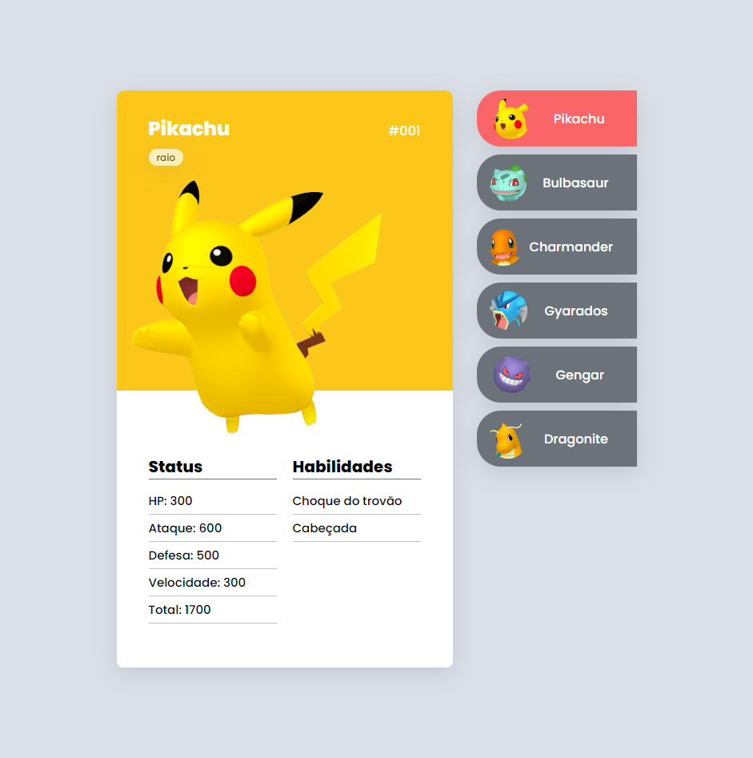

# Mapa DevWeek - Pokedex

Projeto construído durante o evento Mapa DevWeek.

[🔗 Clique aqui para acessar](https://evertonsc.github.io/mapadev-week-pokedex/)

## 🛠 Tecnologias

- HTML
- CSS
- JavaScript
- Git e Github

> Resumo

É uma pokedex com 6 pokemons incluindo:

- Nome do Pokemon no canto superior esquerdo;
- Tipo do Pokemon (ex: raio, grama, fogo etc) abaixo do nome dele;
- A numeração do Pokemon no canto superior direita;
- 4 atributos deles (saúde, ataque, defesa e velocidade) e o Total reservando a soma dos atributos;
- Duas habilidades em cada card Pokemon;

Ao clicar em um outro Pokemon no menu a direita do card, é possível trocar dinâmicamente todos os itens citados acima no Resumo.

> O que aprendi

 É um projeto relativamente simples, mas para um dos primeiros penso que estou no caminho certo. Aprendi como escrever coisas na tela com HTML, dar estilo ao projeto com CSS e algumas interações e mudanças na tela com JavaScript. Também tomei conhecimento de como fazer relação entre HTML, CSS e JS.

